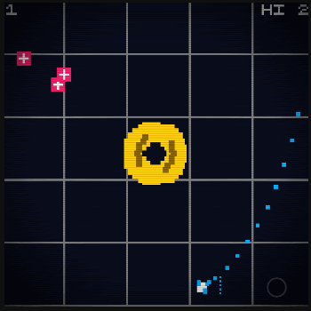

# Crisp Game Library Collection

This is a collection of tiny arcade-like web games using [Kenta Cho's Crisp Library](https://github.com/abagames/crisp-game-lib), started in July 2021. The games, below, are listed in chronological order.

## Orbital Defense

**Core theme**: revolving around earth.

As a satellite orbitting earth, defend the planet with minimal control over your weapon.

My first game ever using CrispGameLib, experimenting with the idea of using one button for multiple functions.

[Play](https://junongx.github.io/crips-game-lib-collection/?orbitaldefense)

## Dynamic Duo

**Core theme**: multiple ships in a shoot'em up.

What's better than one shoot'em up game? Two of them simultaneously interweaving. I've always wanted to make a bullet hell in which the player controls multiple ships at the same time. However, with the engine's limitation to single touch, the idea was scaled down to something more simple, with a slightly different hook. I'd probably make a version with four ships and turn it into a strategy game one of these days.

[Play](https://junongx.github.io/crips-game-lib-collection/?dynamicduo)

## Charge Rush RE

**Core theme**: remaking the original Charge Rush.

[CHARGE RUSH](http://abagames.sakura.ne.jp/html5/cr/), made with [MGL.COFFEE](https://github.com/abagames/mgl.coffee) was one of the earliest exposure I had to Kenta's works, and it has influenced me in profound ways. After all these years of still playing it every now and then, the idea of remaking it was a no brainer ([Celox Inpes](https://github.com/JunoNgx/celox-inpes) was another much less satisfying attempt.).

While my version has inevitably diverged from the original game in a few ways, some of the original features were painstakingly reversed engineered, such as enemy spawning pattern, and most importantly, the audio: weaving the game sound effects with minimal music to imitate the feeling of a drum machine song. Due to the engine's lack of control over audio, a lot of trials and erros were made to reach the desirable outcome, but I was quite satisfied with the release state nevertheless.

[Play](https://junongx.github.io/crips-game-lib-collection/?chargerushre)

## Blitzed

**Core theme**: zoned touchscreen control; dynamic monochrome recolouring.

Not much to be said about this, besides the idea of implementing a more traditional control meant for smartphone touchscreen. Due to the engine's simplicity, crazy ideas on the game visuals were omitted. The game also saw some of the more complex enemies' movement implemented.

[Play](https://junongx.github.io/crips-game-lib-collection/?blitzed)

## Juggle

**Core theme**: self-explanatory. Just "juggle".

Made under an hour while listening to a podcast. Probably the most fun so far I have had in this catalogue.

[Play](https://junongx.github.io/crips-game-lib-collection/?juggle)
## Artificial Gravity

**Core theme**: Navigating orbit and gravity.

While this looks visually similar to Orbital Defense, there are a lot more than meets the eyes. I had the idea of using thrusters to navigate and control a ship's orbit against a two-dimensional gravity a long time, though not the time to implement it (until this game). The hook is for the player to master the gravitional force and use it to their advantage to reach the objective destination. Despite being one of the slowest games in the catalogue, it is highly challenging.

Multiple versions of this game existed when it was made. A previous version involves firing projectiles (which also doubles as thruster, not unlike the current version) and destroying enemies while picking up bonus packges, but I did not feel the element complementing the hook. The core was originally a Mars-like planet, but was changed to a machinery object. Together with the background grids, they created an artificial lab-like setting.

[Play](https://junongx.github.io/crips-game-lib-collection/?artificialgravity)

## Source

This repository was forked and had releases from the original author (Kenta Cho) removed. The source of my games are stored at `docs/<game-name>/main.js`. The rest of the repository is the engine's source.

## Build guide

1. Clone this repository
2. `npm install` from the repository root directory
3. `npm run watch_games`
4. Open `http://localhost:4000?<game-folder-name-in-docs>` with a browser with only the question mark
5. For example: `http://localhost:4000?orbitaldefense`

For more information, visit the original [CrispGameLib's repository](https://github.com/abagames/crisp-game-lib).

# License

This project was released under MIT license.
