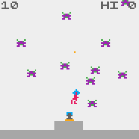

# Crisp Game Library Collection

Despite having been a huge fan of [ABAGames](https://twitter.com/abagames) (Kenta Cho) for a long time, (since the inception of [MGL](https://github.com/abagames/mgl) and [MGL-coffee](https://github.com/abagames/mgl.coffee)), my attempts to use his tools had always been obstructed by the lack of documentation and idiosyncratic styles. Things finally changed with [CrispGameLib](https://github.com/abagames/crisp-game-lib), his most accessible work yet.

With many of the basic and common components of a game being taken of by the library, the developer is empowered to focus only gameplay, protyping, iterations, and unique elements of the game. My favourite discovery while using the library was [JSDoc annotations](https://www.typescriptlang.org/docs/handbook/jsdoc-supported-types.html), providing a superb solution to one of Javascript's major problems, in a manner not unlike TypeScript, but leaner. I have also written [a long and detailed tutorial for CrispGameLib](https://github.com/JunoNgx/crisp-game-lib-tutorial), which you are welcomed to check out.

This project is on-going and actively worked on, with new games being added.

[View the project's listing page on my Itch.io page](https://junongx.itch.io/crisp-webgame-collection).
## Orbital Defense

**Core theme**: revolving around earth.

As a satellite orbitting earth, defend the planet with minimal control over your weapon.

My first game ever using CrispGameLib, experimenting with the idea of using one button for multiple functions.

[Play](https://junongx.github.io/crips-game-lib-collection/?orbitaldefense)

## Dynamic Duo

**Core theme**: multiple ships in a shoot'em up.

What's better than one shoot'em up game? Two of them simultaneously interweaving. I've always wanted to make a bullet hell in which the player controls multiple ships at the same time. However, with the engine's limitation to single touch, the idea was scaled down to something more simple, with a slightly different hook. I'd probably make a version with four ships and turn it into a strategy game one of these days.

[Play](https://junongx.github.io/crips-game-lib-collection/?dynamicduo)

## Charge Rush RE

**Core theme**: remaking the original Charge Rush.

[CHARGE RUSH](http://abagames.sakura.ne.jp/html5/cr/), made with [MGL.COFFEE](https://github.com/abagames/mgl.coffee) was one of the earliest exposure I had to Kenta's works, and it has influenced me in profound ways. After all these years of still playing it every now and then, the idea of remaking it was a no brainer ([Celox Inpes](https://github.com/JunoNgx/celox-inpes) was another much less satisfying attempt.).

While my version has inevitably diverged from the original game in a few ways, some of the original features were painstakingly reversed engineered, such as enemy spawning pattern, and most importantly, the audio: weaving the game sound effects with minimal music to imitate the feeling of a drum machine song. Due to the engine's lack of control over audio, a lot of trials and erros were made to reach the desirable outcome, but I was quite satisfied with the release state nevertheless.

[Play](https://junongx.github.io/crips-game-lib-collection/?chargerushre)

## Blitzed

**Core theme**: zoned touchscreen control; dynamic monochrome recolouring.

Not much to be said about this, besides the idea of implementing a more traditional control meant for smartphone touchscreen. Due to the engine's simplicity, crazy ideas on the game visuals were omitted. The game also saw some of the more complex enemies' movement implemented.

[Play](https://junongx.github.io/crips-game-lib-collection/?blitzed)

## Juggle

**Core theme**: self-explanatory. Just "juggle".

Made under an hour while listening to a podcast. Probably the most fun so far I have had in this catalogue.

[Play](https://junongx.github.io/crips-game-lib-collection/?juggle)
## Artificial Gravity

**Core theme**: Navigating orbit and gravity.

While this looks visually similar to Orbital Defense, there are a lot more than meets the eyes. I had the idea of using thrusters to navigate and control a ship's orbit against a two-dimensional gravity a long time, though not the time to implement it (until this game). The hook is for the player to master the gravitional force and use it to their advantage to reach the objective destination. Despite being one of the slowest games in the catalogue, it is highly challenging.

Multiple versions of this game existed when it was made. A previous version involves firing projectiles (which also doubles as thruster, not unlike the current version) and destroying enemies while picking up bonus packges, but I did not feel the element complementing the hook. The core was originally a Mars-like planet, but was changed to a machinery object. Together with the background grids, they created an artificial lab-like setting. The navigation tool also underwent several versions (one involved only presenting an approximation of the ship's current velocity) before settling down on an accurate projection of the trajectory, which I had a lot of fun implementing.

[Play](https://junongx.github.io/crips-game-lib-collection/?artificialgravity)

## Sweeper Cannon

**Core theme**: Missile Command-like static defense.

Starting off as a Missile Command demake, the game had gone through tons of iterations before the current final form, which was not exactly something I was proud. I spent a massive amount of time in design block and attempted multiple iterations. The final form was something I sort of "settled" with to move on to other projects.

[Play](https://junongx.github.io/crips-game-lib-collection/?sweepercannon)

## Flight 8

**Core theme**: Turning navigation.

Despite having been completed earlier, this is still technically the 8th game (hence the number in the title). Remotely controlled missile was one of my many iterations in the previous game, which eventually spun into its own thing, with entirely new concept and premise.

Had tons of infinite loop while making the game because of the way I staged the spawning of the new hoops for the new round. The player's brief invulnerability was a quickfix to a much more complex problem of arranging the hoops that facilitates the gameplay.

[Play](https://junongx.github.io/crips-game-lib-collection/?flight8)

## Source

This repository was forked and had releases from the original author removed. The sources of my games are stored at `docs/<game-name>/main.js`. The rest of the repository is the engine's source.

## Build guide

1. Clone this repository
2. `npm install` from the repository root directory
3. `npm run watch_games`
4. Open `http://localhost:4000?<game-folder-name-in-docs>` with a browser with only the question mark. For example: `http://localhost:4000?orbitaldefense`.

For more information, visit the original [CrispGameLib's repository](https://github.com/abagames/crisp-game-lib).

# License

This project was released under MIT license.
